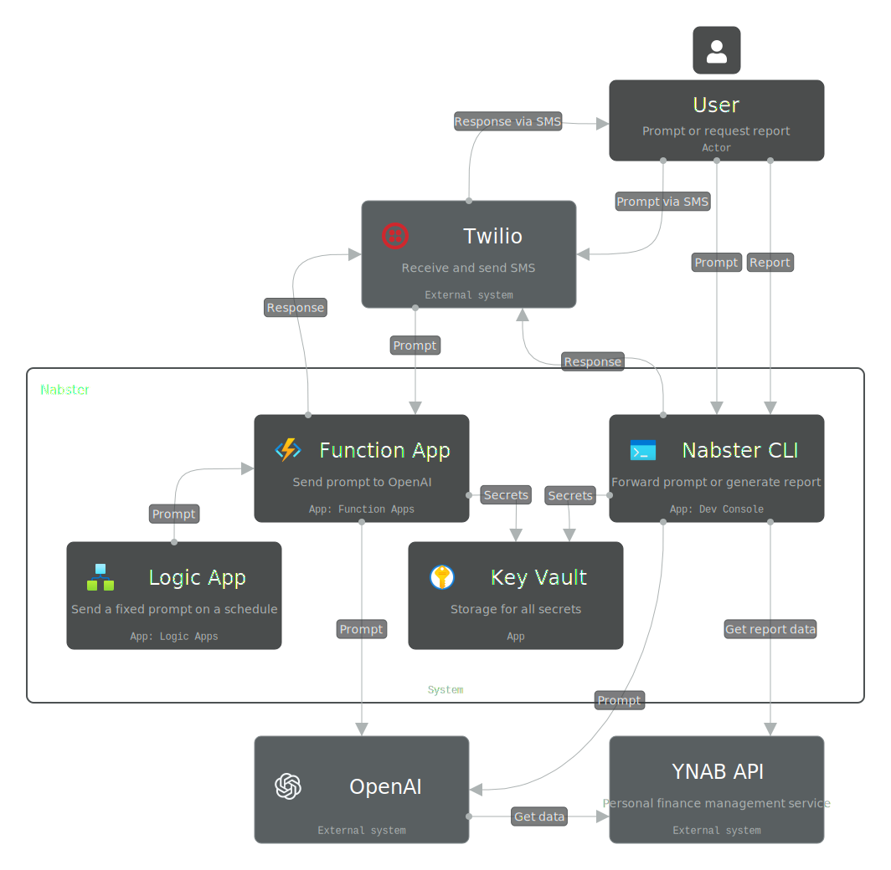
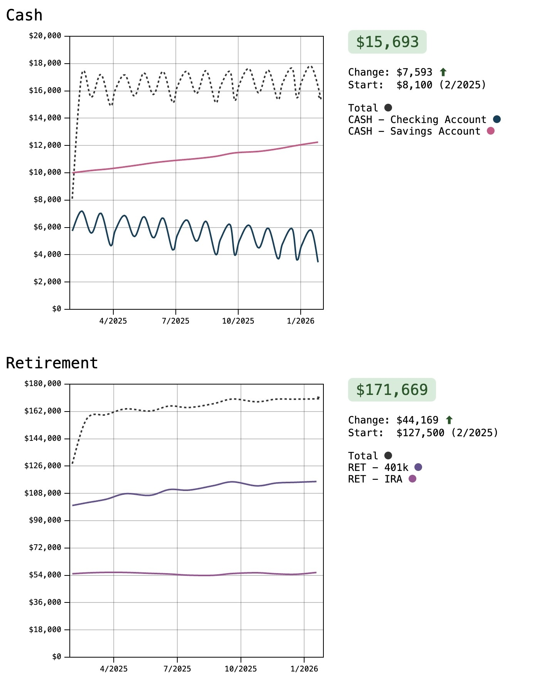
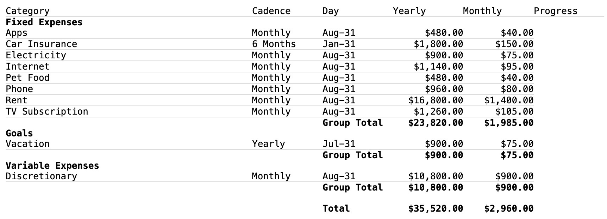
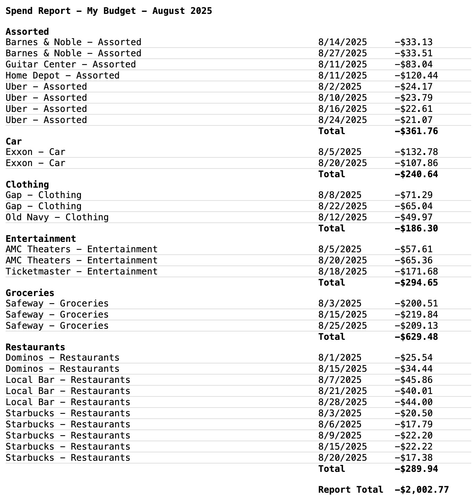

# nabster
An app for analyzing and reporting on your personal finances in [YNAB](https://www.youneedabudget.com) written in C# and built on Azure. There are two features:
- An AI chatbot with integrated SMS that can answer questions about your financial data in YNAB.

- A suite of reports for historical account balances, monthly spending, and budget planning.

## Design

Users interact with Nabster via the CLI or SMS. To generate reports, the user uses the CLI. To chat, the user can use either the CLI or SMS. When the user requests a report from the CLI, it retrieves the user's financial data from the YNAB API, generates the report, and then exports it to the user's desktop as an Excel spreadsheet or self-contained HTML file.

When the user asks a question via the CLI, the prompt is forwarded to OpenAI which queries the YNAB API for the necessary financial data and then returns the answer via the console or SMS. When the user asks a question via SMS, Twilio calls a web hook that is handled by a function app which then forwards the prompt to OpenAI which queries the YNAB API and then calls back to Twilio to send the answer to the user.



All secrets are stored in a key vault. The function app and logic app use system-assigned managed identities to authenticate with the key vault. The CLI uses the default Azure credential to authenticate with the key vault. Similarly, when running the function app locally, it also uses the default Azure credential to access the key vault. Both the function app and logic app use a consumption plan to minimize costs.

## Code structure

The code is organized into four projects:

- Nabster.Chat - uses Semantic Kernel backed by OpenAI with a plug-in that allows it to call the YNAB API to answer questions about the user's financial data with responses sent via SMS. This is used by both the function app and the CLI.

- Nabster.Chat.Functions - a wrapper around Nabster.Chat that implements Twilio web hooks allowing users to submit questions via SMS.

- Nabster.Reporting - a set of report generators that retrieve data from the YNAB API and generate reports in HTML or Excel.

- Nabster.Cli - a command-line interface to both the chat and reporting features.

## Reports

### Historical Report

This report uses charts to visualize your account balances over the past year. It takes a list of account groups as input and for each group, shows a timeseries line chart of the total value of each group. The output is a self-contained HTML file with inline SVG charts.

This report is especially useful to visualize the performance of groups of investments, such as for retirement or college.

The typical use case for this is to group your investment accounts in various ways and then visualize their performance over time.



### Planning Report

This report lists each budget category along with any goals and the yearly and monthly cost for each. The purpose is to figure out for each category what the typical monthly cost is over the long term, not at a specific point in time (which is what YNAB's website is really good at). This can then be used for long-term cash flow planning.

If a category has a repeating target then the monthly cost is calculated directly from that. For example, if the target is $120 annually then the monthly cost is calculated as $10 (even if this year you've already funded the full amount).

It generates the report and saves it as either an Excel spreadsheet or self-contained HTML file to your desktop. Here's what it looks like:



### Spend Report

This report lists all transactions for a specific category and month. The transactions are grouped by the memo field. This is particularly useful if you have one category for your discretionary spending, but still want to be able to sub-categorize your spending.



## How to use
Clone the repo and open up the folder (I use VS Code for Mac with the C# Dev Kit, Azure, and Function App extensions).

**1. Edit the configuration files**

Edit the `Deployments/infra.bicepparam` file to add your YNAB personal access token, Twilio credentials, and your YNAB budget info. If you want to run the CLI via VS Code, then edit the `.vscode/launch.json` to adjust the parameters for your YNAB budget info.

**2. Deploy the infrastructure**

```shell
cd Deployments
./deploy-infra.sh mynabster infra.bicepparam
./deploy-code.sh mynabster
```

The function app can also be run locally and supports debugging with breakpoints.

**3. Run the CLI**

Run the app via VS Code or directly via the command line.

## License

Copyright (c) 2025 Tom Bulatewicz

Licensed under the MIT license