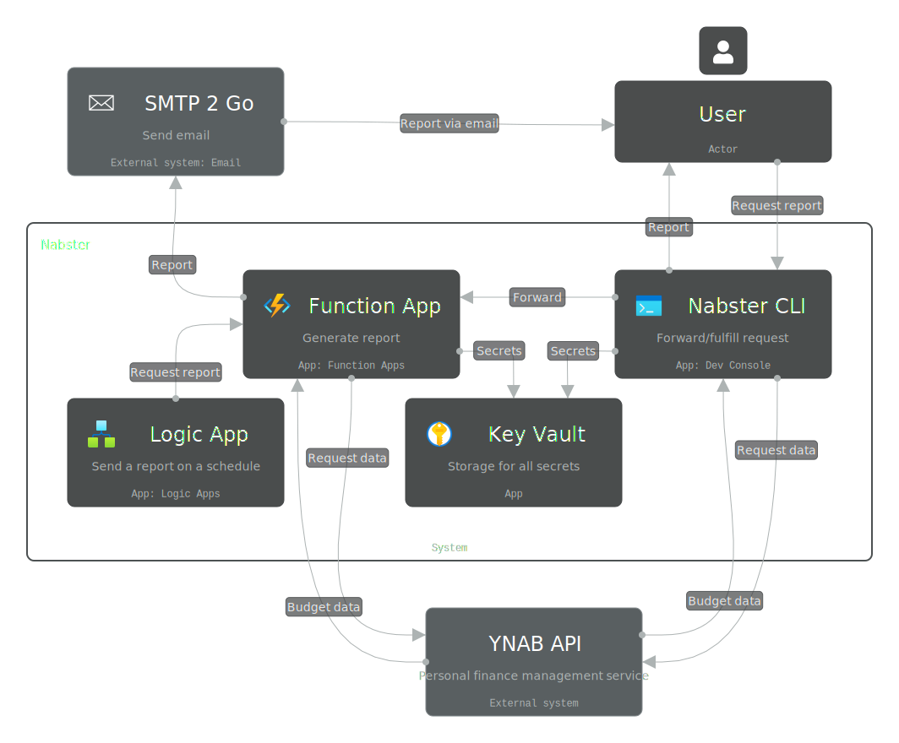
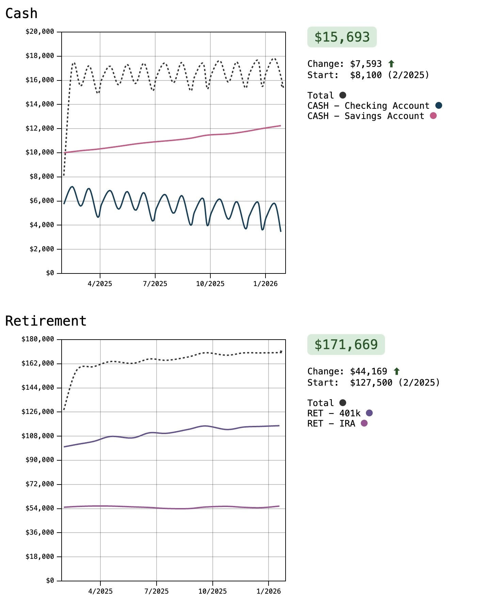
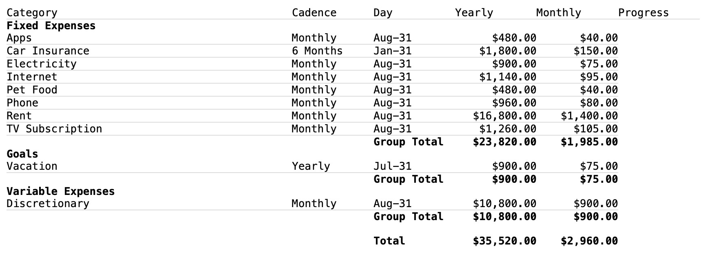
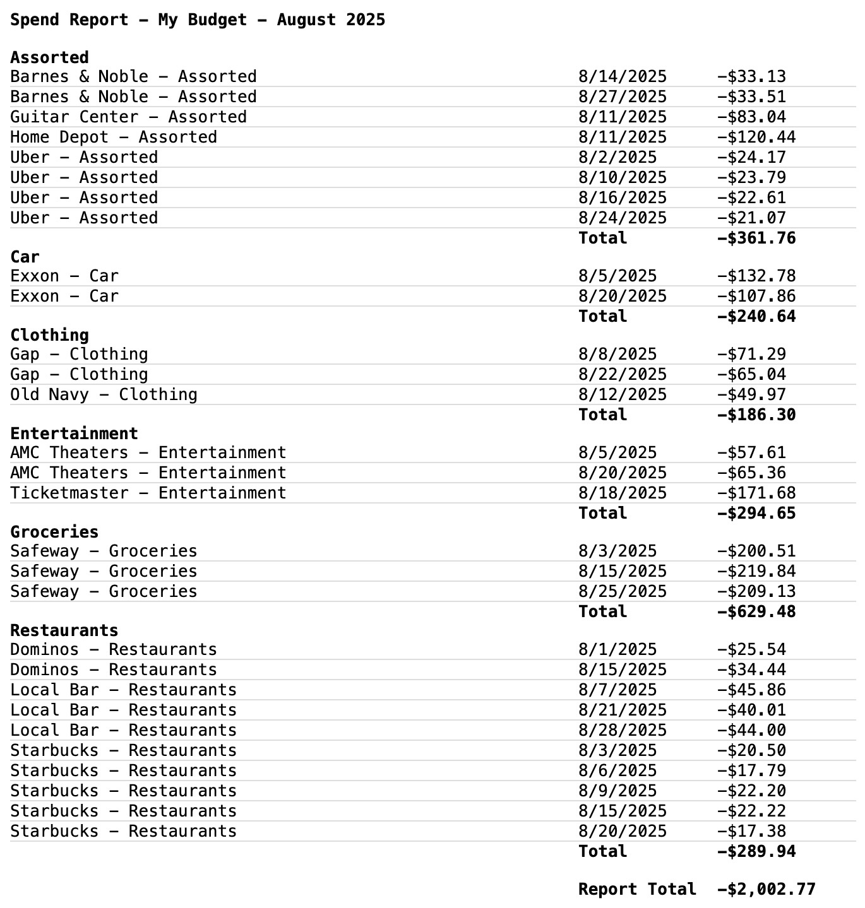

# nabster
An app for analyzing and reporting on your personal finances in [YNAB](https://www.youneedabudget.com) written in C# and built on Azure. It provides a suite of reports for historical account balances, monthly spending, and budget planning, plus a daily summary that is emailed automatically on a schedule.

## Design

Users interact with Nabster via the CLI. To generate ad-hoc reports, the CLI retrieves the user's financial data from the YNAB API, generates the report, and exports it to the user's desktop as an Excel spreadsheet or self-contained HTML file.

The daily summary report is produced by a function app. A logic app calls the function app on a recurring schedule; the function app pulls the latest activity from the YNAB API, formats a short summary, and emails it to the configured recipients via SMTP2GO. The same daily report can also be generated locally from the CLI, either by building it directly or by invoking the function app over HTTP.



All secrets are stored in a key vault. The function app and logic app use system-assigned managed identities to authenticate with the key vault. The CLI uses the default Azure credential to authenticate with the key vault. Similarly, when running the function app locally, it also uses the default Azure credential to access the key vault. Both the function app and logic app use a consumption plan to minimize costs.

## Code structure

The code is organized into four projects:

- Nabster.Reporting - a set of report generators that retrieve data from the YNAB API and generate reports in plain text, HTML, or Excel.

- Nabster.Server - an Azure Functions app that exposes an `IncomingMessage` HTTP endpoint. When called (typically by the logic app), it generates the daily report and optionally emails it to one or more recipients.

- Nabster.Cli - a command-line interface to the reporting features.

- Nabster.Mcp - an MCP server that allows agents to retrieve budget and account data from the YNAB API.

## Reports

### Historical Report

This report uses charts to visualize your account balances over the past year. It takes a list of account groups as input and for each group, shows a timeseries line chart of the total value of each group. The output is a self-contained HTML file with inline SVG charts.

This report is especially useful to visualize the performance of groups of investments, such as for retirement or college.

The typical use case for this is to group your investment accounts in various ways and then visualize their performance over time.



### Planning Report

This report lists each budget category along with any goals and the yearly and monthly cost for each. The purpose is to figure out for each category what the typical monthly cost is over the long term, not at a specific point in time (which is what YNAB's website is really good at). This can then be used for long-term cash flow planning.

If a category has a repeating target then the monthly cost is calculated directly from that. For example, if the target is $120 annually then the monthly cost is calculated as $10 (even if this year you've already funded the full amount).

It generates the report and saves it as either an Excel spreadsheet or self-contained HTML file to your desktop. Here's what it looks like:



### Spend Report

This report lists all transactions for a specific category and month. The transactions are grouped by the memo field. This is particularly useful if you have one category for your discretionary spending, but still want to be able to sub-categorize your spending.



### Daily Report

This report is a short plain-text summary of the current month's activity for a selected set of categories, showing the spending amount and percentage of the monthly budget used. It is intended to be delivered as an email on a schedule via the function app, but can also be generated locally from the CLI.

## How to use
Clone the repo and open up the folder (I use VS Code for Mac with the C# Dev Kit, Azure, and Function App extensions).

**1. Customize the infrastructure**

Edit the `Deployments/infra.bicepparam` file to name the Azure resources that will be created and to set your YNAB personal access token, SMTP2GO credentials, and the email addresses that should receive the daily report.

**2. Deploy the infrastructure**

```shell
cd Deployments
./deploy-infra.sh mynabster infra.bicepparam
./deploy-code.sh mynabster
```

The function app can also be run locally and supports debugging with breakpoints.

**3. Add a config file for the CLI:**

Create a new file called `config.json` inside the `Nabster.Cli` folder and set the URL based on the name of your Azure key vault.

```json
{
    "Urls":
    {
        "KeyVaultUrl": "https://mynabster-keyvault.vault.azure.net"
    }
}
```

**4. Run the CLI**

If you want to run the CLI via VS Code then edit the `.vscode/launch.json` to adjust the parameters.

## License

Copyright (c) 2026 Tom Bulatewicz

Licensed under the MIT license